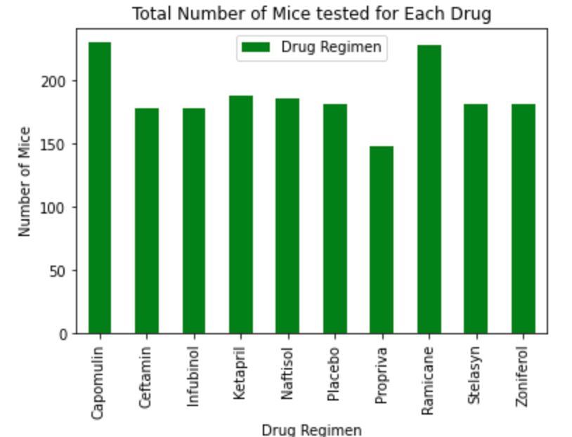
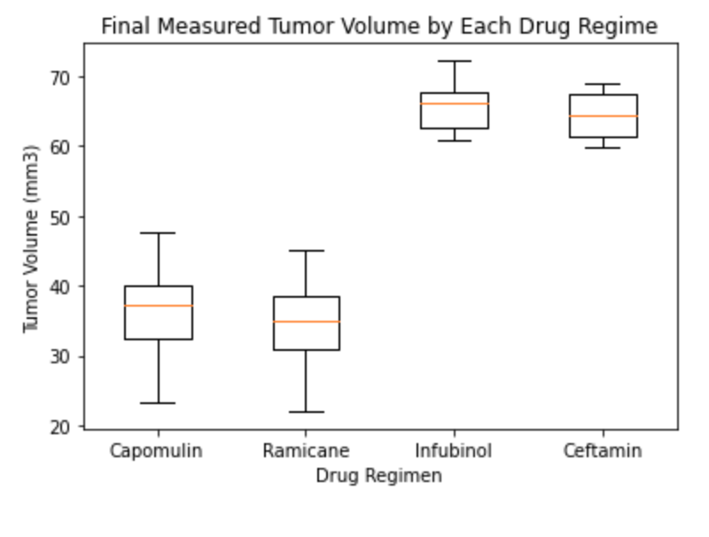
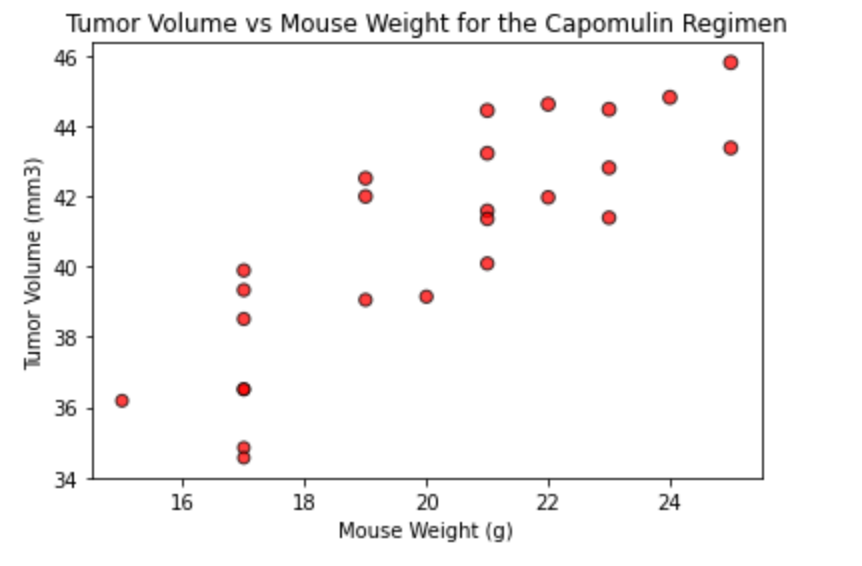

The animal study was conducted with fairly equal number of mice for each experimental drugs, however, Capomulin had more mice in its study compared to other.

Capomulin was the second most effective drug to reduce the tumor compared to other drugs. The most effective drug was Ramicane.

Within the study, the bigger the mouse is, the bigger the volume of the tumor it has, which makes sense. And Capomulin was proved to be more efficient over time in the study. 

